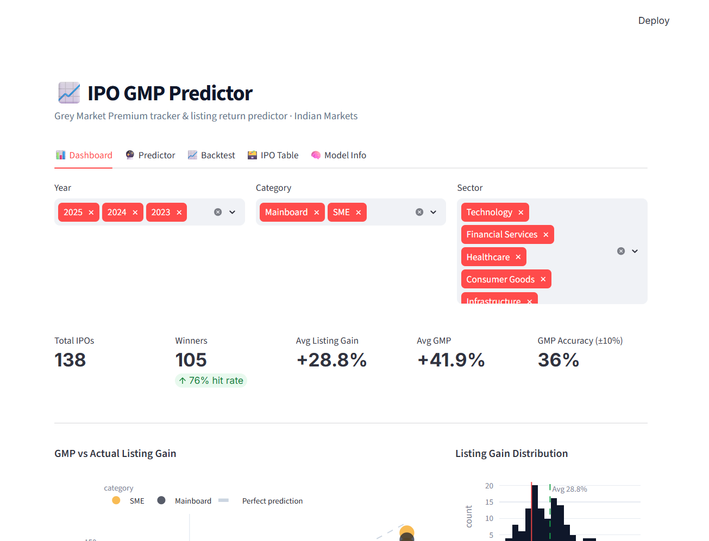

# IPO GMP Predictor

**An XGBoost pipeline that predicts IPO listing-day returns — feature engineering, time-series CV, calibrated confidence bands. No API key; seeds and trains itself on first boot.**

[](https://github.com/siddharthgaur1/ipo-gmp/actions/workflows/ci.yml) [](https://www.python.org/downloads/) [](LICENSE) [](#quickstart)

> **Live demo:** _pending deploy to Hugging Face Spaces (free CPU)._ Runs with no
> key: on first boot it seeds the (synthetic) dataset and trains the models in
> ~2 seconds, so nothing is committed as a stale binary. Screenshot below is the
> app running locally from an empty clone, unedited.



> ⚠️ **The dataset is synthetic.** Every metric here is a real cross-validation
> result *on synthetic data* — it demonstrates the ML pipeline, not real-market
> predictive power. Details in [Data](#data--read-this-before-quoting-any-metric-below).

## Quickstart

```bash
git clone https://github.com/siddharthgaur1/ipo-gmp
cd ipo-gmp
pip install -r requirements.txt
streamlit run src/app.py          # seeds data + trains models on first boot (~2s)
```

No API key, no external data, no cloud. Measured CV results (synthetic data):
**MAE ≈ 12.7%**, **R² ≈ 0.87**, **directional accuracy ≈ 91%**, confidence band
±4.7%. Security notes: [SECURITY.md](SECURITY.md).

---

Predicts Indian IPO listing-day returns from pre-listing Grey Market Premium
(GMP) and subscription data. GMP alone is the strongest available pre-listing
signal but noisy on its own; this combines it with subscription mix (QIB/NII/
retail), GMP momentum, deal size, and sector to output a point estimate,
confidence band, and a STRONG BUY/BUY/NEUTRAL/AVOID signal, plus a dashboard
for exploring historical patterns and backtesting the signal.

## Data — read this before quoting any metric below

**The dataset is entirely synthetic**, generated by `scripts/seed_data.py`.
`listing_gain_pct` (the model's prediction target) is constructed directly as
`gmp_pct * random_factor + noise` — the generator hand-encodes the exact
relationship the model then learns to recover. The accuracy numbers in this
README are real outputs of this codebase, and the feature-engineering and
time-series-CV methodology are both sound, but **none of it has been
validated against real historical IPO outcomes**. Treat this as a
demonstration of the modeling pipeline, not evidence the strategy works on
real markets. See "What I'd improve" for the actual next step.

## Architecture

```
scripts/seed_data.py                 (synthetic IPO generator, seed=42)
        │
        ▼
data/ipo_gmp.db (SQLite, 800 IPOs)
        │
        ▼
src/model.py
   ├── engineer_features()   GMP momentum, QIB/NII ratio, log-scaled size, sector encoding
   ├── train()                5-fold TimeSeriesSplit CV → final fit on all data
   │      ├── XGBRegressor    predicts listing_gain_pct
   │      └── XGBClassifier   predicts P(listing_gain_pct > 0)
   ├── _backtest()            rolling monthly signal vs. all-IPO baseline
   └── predict_one()          single-IPO inference + confidence band
        │
        ▼
models/{regressor,classifier}.pkl, models/meta.json (CV metrics, importances, backtest)
        │
        ▼
src/app.py (Streamlit, 5 tabs: Dashboard / Predictor / Backtest / IPO Table / Model Info)
```

## Tech stack

| Choice | Why |
|---|---|
| XGBoost (regressor + classifier) | Tabular data with nonlinear feature interactions (e.g. GMP momentum only matters conditional on subscription level) — gradient boosting handles that natively without manual interaction terms. |
| Two separate models (regression + classification) | A point estimate and a direction probability answer different questions — "how much" vs. "how confident am I it's positive" — and XGBoost's classifier gives a better-calibrated probability than deriving one from regression residuals. |
| `TimeSeriesSplit` (not random k-fold) | IPO market conditions drift over time; random k-fold would leak future market regime information into past-fold training and overstate accuracy. |
| SQLite | Single-file, zero-setup, sufficient for an 800-row dataset that's read far more than written. |
| Streamlit | Fastest path from a trained model to an interactive, shareable dashboard — no separate frontend needed for this scope. |
| Confidence band = ±1 residual std | Cheap, interpretable uncertainty estimate without the complexity of quantile regression or conformal prediction — adequate for a portfolio-stage signal, not a production trading system. |

## Prerequisites & setup

Python 3.11+. No API keys or external services — everything runs offline
against the synthetic dataset.

```bash
pip install -r requirements.txt
python scripts/seed_data.py   # generates data/ipo_gmp.db (deterministic, seed=42)
python src/model.py           # trains + saves models/*.pkl, models/meta.json (~10s)
```

## Running it

```bash
streamlit run src/app.py
pytest tests/ -v               # 19 tests
```

## Design decisions

**GMP momentum (day-1 → final), not just final GMP.** A GMP that rose from
₹20 to ₹80 reads as a stronger bullish signal than one that started at ₹100
and fell to ₹80, even though they end at the same level — momentum is
`(gmp_final - gmp_day1) / |gmp_day1|`, clipped to ±5 to bound the effect of
near-zero day-1 GMP.

**QIB/NII subscription ratio as a feature, not raw subscription counts.**
Institutional (QIB) demand and leveraged HNI (NII) demand say different
things about an IPO's quality — a high QIB/NII ratio suggests informed
institutional conviction rather than leveraged retail-adjacent speculation.
Modeling the ratio directly, rather than leaving XGBoost to infer it from
the two raw columns, made the signal show up cleanly in feature importance.

**Backtest reuses the training data (explicitly flagged as in-sample in the
UI).** A true walk-forward backtest — refitting the model at each point in
time using only data available then — is the honest version of this and
isn't implemented yet; see "What I'd improve."

## Performance (from an actual run — synthetic data, see above)

5-fold `TimeSeriesSplit` cross-validation, 800 IPOs:

| Metric | Value |
|---|---|
| Directional accuracy | 91.2% |
| Mean absolute error | 12.7% |
| R² | 0.871 |
| Backtest: signal avg return | 55.2% vs. 34.0% all-IPO baseline |

Feature importance is dominated by `gmp_pct` (59%) and `gmp_rs` (17%) —
expected, since those two are the closest proxies to how the synthetic
target was generated. Everything past the top two contributes single-digit
percentages.

## What I'd improve with more time

1. **Real data.** This is the actual gap, not a nice-to-have — replace
   `seed_data.py` with scraped/purchased historical IPO GMP + subscription +
   listing data (e.g. Chittorgarh, Groww IPO pages) and re-run the identical
   pipeline. Every metric above should be treated as provisional until this
   happens.
2. **True walk-forward backtest** instead of reusing training data — refit
   at each historical point using only prior information, matching how the
   model would actually have been deployed.
3. **Quantile regression or conformal prediction** for the confidence band
   instead of a flat ±1 residual std, which assumes symmetric, homoscedastic
   errors that IPO returns (fat-tailed, especially for SME) probably don't
   have.
4. **Feature: sector-relative GMP** (an IPO's GMP% vs. its sector's trailing
   average) — right now sector is only a flat encoded feature, not
   interacted with GMP.

## Related projects

- [llm-regression-detector](https://github.com/siddharthgaur1/llm-regression-detector) — CI/CD regression detection for an LLM classifier's eval suite.
- [rag-hybrid-search](https://github.com/siddharthgaur1/rag-hybrid-search) — hybrid dense+BM25 RAG pipeline with citation verification.
